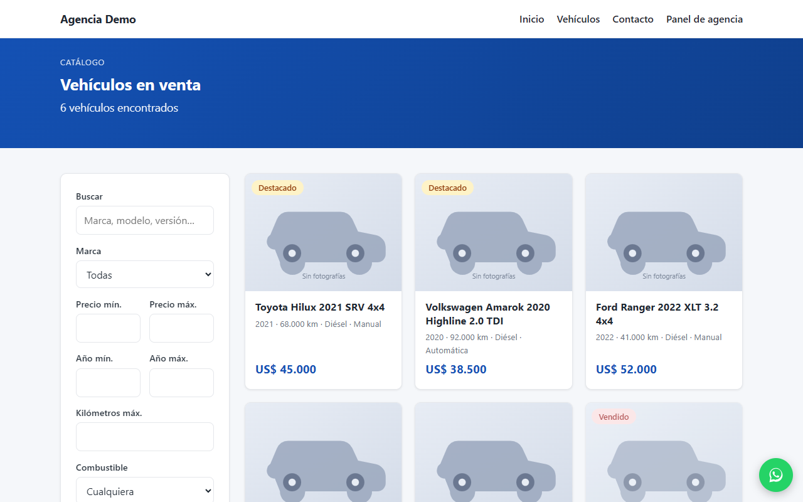
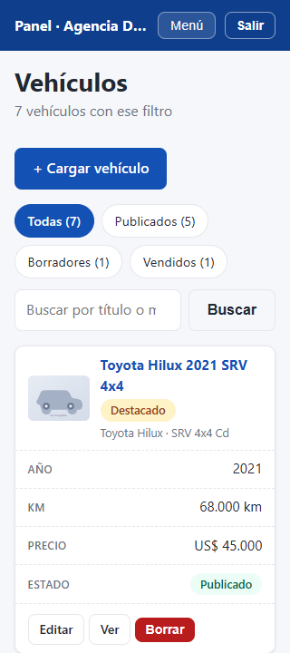
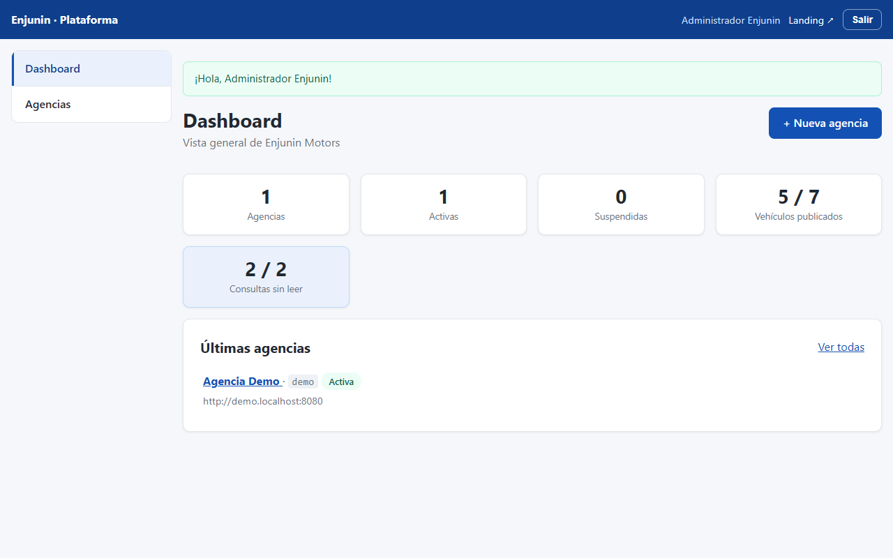

# 🚗 enJunin Motors

> **Vitrina pública** del proyecto *Enjunin Motors* — portal multi-tenant de
> avisos de venta de autos. Acá vas a encontrar descripción, stack y
> capturas; **el código fuente es privado**.

## Qué es

Plataforma multi-tenant para avisos automotores: cada agencia recibe su
subdominio **`agencia.enjunin.com.ar`** (wildcard DNS + SSL) y publica su
catálogo con fotos, mientras un panel central administra agencias, usuarios
y métricas de toda la red.

## Funcionalidades

- 🌐 **Sitio público por agencia** — home con destacados, catálogo con
  filtros (marca, precio, año, km, combustible, caja), ficha de vehículo
  con galería y consultas de clientes (leads).
- 🔑 **Panel de agencia** (`/panel`) — login con recuperación de contraseña,
  CRUD de vehículos con subida de fotos (resize + miniatura + WebP),
  consultas con seguimiento de no-leídas, perfil y logo de la agencia,
  roles dueño/staff.
- 🛠 **Panel de plataforma** (`/admin`) — alta y suspensión de agencias,
  gestión de usuarios por agencia y métricas globales.
- 🔒 **Seguridad** — CSRF en todos los POST, rate limiting en logins,
  Content-Security-Policy estricta (`script-src 'self'`), HSTS, sesiones
  endurecidas, subidas sin ejecución de scripts y `.htaccess` de defensa en
  los directorios sensibles.
- 📱 **Responsive mobile-first** — verificado en 320 / 768 / 1280 px.
- 🗄 **Multi-tenant de verdad** — una sola base con `tenant_id` en cada
  tabla y resolución de agencia por `HTTP_HOST`. PHP puro con MVC propio,
  sin Composer ni frameworks: despliegue por FTP a hosting cPanel.

## Capturas

### 🌐 Sitio público — catálogo con filtros

### 🔑 Panel de agencia — vista móvil (320 px)

### 🛠 Panel de plataforma — dashboard

<!--
## Roadmap

- [x] Fases 0–5 — núcleo MVC, esquema, sitio público, panel de agencia y
      panel de plataforma
- [x] **Fase 6** — despliegue a producción (cPanel) + smoke test
      (desplegado y funcionando en `enjunin.com.ar/autos`, 2026-09-26)
- [ ] **Fase 7** — vitrina transversal `autos.enjunin.com.ar`: cada agencia
      destaca hasta 5 vehículos con galería y CTA hacia su subdominio
      (modelo de negocio: cuota configurable por agencia)
-->      
## Stack

PHP 8 · MySQL/MariaDB · Apache (`mod_rewrite`) · HTML/CSS/JS vanilla ·
MVC propio sin dependencias · Git
